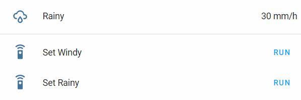

# Home Assistant Entities Script

Python script for Home Assistant to handle state and attributes of existing sensors and entities.
Useful if you need to change a sensor's state or attribute from whithin a script, an automation, or your Lovelace UI.

## Installation

This script use Home Assistant [python_script](https://www.home-assistant.io/integrations/python_script) component and you have to add it to your `configuration.yaml` file.

## Usage

### 1. Set both state and attributes

| Name | Type | Required | Description |
| ---- | :--: | :------: | ----------- |
| action | string | Yes | `set_state_attributes` <br/>Allows to set both state and attributes. |
| entity_id | string | Yes | Entity ID of the sensor to be set. |
| state | string | Yes | The state to be set. |
| attributes | list | Yes | List of attributes to be set (the actual list of attributes depends on the referred entity). |

#### 1.1. Automation Sample

```yaml
- alias: paolo_home_since
  trigger:
    - platform: state
      entity_id: device_tracker.paolo
      from: "not_home"
      to: "home"
  action:
    - service: python_script.entities_aktualisieren
      data:
        action: set_state_attributes
        entity_id: sensor.paolo_home_from
        state: "{{ 'At home since '~ now().strftime('%H.%M') }}"
        attributes:
          - icon: mdi:home
```

#### 1.2. Script Sample

```yaml
turn_on_switch:
  sequence:
    - service: switch.turn_on
      data:
        entity_id: switch.plug_1
    - service: python_script.entities_aktualisieren
      data:
        action: set_state_attributes
        entity_id: sensor.plug_1_status
        state: "{{ 'Switched on at '~ now().strftime('%H.%M') }}"
        attributes:
          - icon: mdi:toggle-switch
```

#### 1.3. Lovelace Sample

```yaml
- type: entities
  entities:
    - sensor.mysensor
    - type: section
    - type: call-service
      name: "Set Windy"
      service: python_script.entities_aktualisieren
      service_data:
        action: set_state_attributes
        entity_id: sensor.mysensor
        state: "3.02"
        attributes:
          - icon: mdi:weather-windy
          - friendly_name: Windy
          - unit_of_measurement: m/s
    - type: call-service
      name: "Set Rainy"
      service: python_script.entities_aktualisieren
      service_data:
        action: set_state_attributes
        entity_id: sensor.mysensor
        state: 30
        attributes:
          - icon: mdi:weather-rainy
          - friendly_name: Rainy
          - unit_of_measurement: mm/h
```



### 2. Set state only

| Name | Type | Required | Description |
| ---- | :--: | :------: | ----------- |
| action | string | Yes | `set_state` <br/>Allows to set a sensor state only. |
| entity_id | string | Yes | Entity ID of the sensor to be set. |
| state | string | Yes | The state to be set. |

#### 2.1. Automation Sample

```yaml
- alias: paolo_home_since
  trigger:
    - platform: state
      entity_id: device_tracker.paolo
      from: "not_home"
      to: "home"
  action:
    - service: python_script.entities_aktualisieren
      data:
        action: set_state
        entity_id: sensor.paolo_home_from
        state: "{{ 'At home since '~ now().strftime('%H.%M') }}"
```

#### 2.2. Script Sample

```yaml
turn_on_switch:
  sequence:
    - service: switch.turn_on
      data:
        entity_id: switch.plug_1
    - service: python_script.entities_aktualisieren
      data:
        action: set_state
        entity_id: sensor.plug_1_status
        state: "{{ 'Switched on at '~ now().strftime('%H.%M') }}"
```

#### 2.3. Lovelace Sample

```yaml
- type: entities
  entities:
    - sensor.mysensor
    - type: section
    - type: call-service
      name: "Set Windy State"
      service: python_script.entities_aktualisieren
      service_data:
        action: set_state
        entity_id: sensor.mysensor
        state: "3.02"
    - type: call-service
      name: "Set Rainy State"
      service: python_script.entities_aktualisieren
      service_data:
        action: set_state
        entity_id: sensor.mysensor
        state: 30
```

### 3. Set attributes only

| Name | Type | Required | Description |
| ---- | :--: | :------: | ----------- |
| action | string | Yes | `set_attributes` <br/>Allows to set a sensor attributes only. |
| entity_id | string | Yes | Entity ID of the sensor to be set. |
| attributes | list | Yes | List of attributes to be set (the actual list of attributes depends on the referred entity). |

#### 3.1. Automation Sample

```yaml
- alias: paolo_home_since
  trigger:
    - platform: state
      entity_id: device_tracker.paolo
      from: "not_home"
      to: "home"
  action:
    - service: python_script.entities_aktualisieren
      data:
        action: set_attributes
        entity_id: sensor.paolo_home_from
        attributes:
          - icon: mdi:home
          - time: "{{ now().strftime('%H.%M') }}"
```

#### 3.2. Script Sample

```yaml
turn_on_switch:
  sequence:
    - service: switch.turn_on
      data:
        entity_id: switch.plug_1
    - service: python_script.entities_aktualisieren
      data:
        action: set_attributes
        entity_id: sensor.plug_1_status
        attributes:
          - icon: mdi:toggle-switch
          - time: "{{ now().strftime('%H.%M') }}"
```

#### 3.3. Lovelace Sample

```yaml
- type: entities
  entities:
    - sensor.mysensor
    - type: section
    - type: call-service
      name: "Set Windy Icon"
      service: python_script.entities_aktualisieren
      service_data:
        action: set_attributes
        entity_id: sensor.mysensor
        attributes:
          - icon: mdi:weather-windy
    - type: call-service
      name: "Set Rainy Icon"
      service: python_script.entities_aktualisieren
      service_data:
        action: set_attributes
        entity_id: sensor.mysensor
        attributes:
          - icon: mdi:weather-rainy
```

### 4. Delete an existing attribute

| Name | Type | Required | Description |
| ---- | :--: | :------: | ----------- |
| action | string | Yes | `delete_attribute` <br/>Delete an existing attribute. |
| entity_id | string | Yes | Entity ID of the sensor to be set. |
| attribute | string | Yes | Attribute to be deleted from the sensor definition. |

#### 4.1. Automation Sample

```yaml
- alias: paolo_not_home
  trigger:
    - platform: state
      entity_id: device_tracker.paolo
      from: "home"
      to: "not_home"
  action:
    - service: python_script.entities_aktualisieren
      data:
        action: delete_attribute
        entity_id: sensor.paolo_home_from
        attribute: time
```

#### 4.2. Script Sample

```yaml
turn_on_switch:
  sequence:
    - service: python_script.entities_aktualisieren
      data:
        action: delete_attribute
        entity_id: sensor.plug_1_status
        attribute: icon
```

#### 4.3. Lovelace Sample

```yaml
- type: entities
  entities:
    - sensor.mysensor
    - type: section
    - type: call-service
      name: "Set Windy Icon"
      service: python_script.entities_aktualisieren
      service_data:
        action: delete_attribute
        entity_id: sensor.mysensor
        attribute: icon
```
